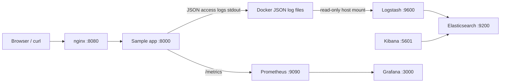

# DevOps L2: Local Observability Stack

This project is a small, reproducible Docker Compose observability lab. It runs a
sample application behind nginx, stores Docker JSON logs in Elasticsearch through
Logstash, and exposes application metrics to Prometheus and Grafana.

## Architecture



All services share one private `observability` bridge network. Only nginx is
intended as the public entry point; Elasticsearch, Kibana, Logstash, Prometheus,
and Grafana are bound to localhost for local administration.

## Prerequisites and startup

- Docker Engine 24+ with the Compose v2 plugin (`docker compose version`)
- At least 8 GB RAM allocated to Docker; Elasticsearch uses a 512 MiB heap and
  Logstash uses a 256 MiB heap
- Linux Docker host (the Logstash file input reads
  `/var/lib/docker/containers`). On Docker Desktop, use the troubleshooting
  alternative below if that path is not shared.
- Approximately 5 GB free disk space for images and local volumes
- A browser and `curl`

```bash
cd /home/mohit/Desktop/Projects/devops-L2
docker compose config
docker compose up -d --build
docker compose ps
```

Pinned image versions are used in `docker-compose.yml` and the application
image is built from `python:3.12.8-slim-bookworm`.

## Project structure and ports

| Path/service | Container port | Host port | Purpose |
| --- | ---: | ---: | --- |
| `app/` | 8000 | internal only | HTTP app, health, metrics, JSON logs |
| `nginx/` | 8080 | 8080 | Reverse proxy entry point |
| Elasticsearch | 9200 | 9200 (localhost) | Log storage and search |
| Logstash | 9600 | 9600 (localhost) | Pipeline monitoring and ingestion |
| Kibana | 5601 | 5601 (localhost) | Log search UI |
| Prometheus | 9090 | 9090 (localhost) | Metrics collection and query API |
| Grafana | 3000 | 3000 (localhost) | Metrics dashboard |

All services use Docker DNS names on the private `observability` bridge
network. The app is not published to the host; nginx reaches it as
`http://app:8000`. Prometheus scrapes `app:8000/metrics`, Grafana reaches
`http://prometheus:9090`, and Kibana/Logstash reach
`http://elasticsearch:9200`.

## Exact verification commands

Generate traffic through nginx and inspect the application:

```bash
curl -i http://localhost:8080/
curl -i http://localhost:8080/health
curl -s http://localhost:8080/metrics
docker compose logs --tail=20 app
```

Check Elasticsearch, Kibana, and Logstash:

```bash
curl -s http://localhost:9200/_cluster/health?pretty
curl -s http://localhost:9600/_node/pipelines?pretty
curl -s http://localhost:5601/api/status | python3 -m json.tool
curl -s http://localhost:9200/_cat/indices?v
curl -s 'http://localhost:9200/docker-logs-*/_search?size=3&sort=@timestamp:desc' | python3 -m json.tool
```

Allow 15–60 seconds for Logstash to read the Docker JSON file and index events.
The application and nginx logs are both eligible for ingestion.

Check metrics and dashboard provisioning:

```bash
curl -s http://localhost:9090/-/ready
curl -s 'http://localhost:9090/api/v1/targets' | python3 -m json.tool
curl -s 'http://localhost:9090/api/v1/query?query=up{job="sample-app"}' | python3 -m json.tool
curl -s http://localhost:3000/api/health
curl -u admin:admin -s http://localhost:3000/api/search | python3 -m json.tool
```

Inspect health checks and internal networking:

```bash
docker compose ps
docker inspect --format '{{.Name}} {{.State.Health.Status}}' $(docker compose ps -q)
docker network ls
docker network inspect devops-l2_observability
docker compose exec -T nginx getent hosts app
docker compose exec -T nginx wget -qO- http://app:8000/health
```

Open the UIs locally:

- nginx/app: <http://localhost:8080>
- Kibana: <http://localhost:5601>
- Prometheus: <http://localhost:9090>
- Grafana: <http://localhost:3000> (`admin` / `admin`)

In Kibana, create a data view named `docker-logs-*` with `@timestamp` as the
time field. Grafana provisions the Prometheus datasource and **Sample App
Overview** dashboard automatically.

## Data flows

1. nginx proxies requests to the app. The app returns `/`, `/health`, and
   Prometheus-compatible `/metrics` and writes one JSON access event per request
   to stdout.
2. Docker's default `json-file` logging driver writes each stdout line to a
   host container log file. Logstash's read-only file input reads those files,
   decodes the Docker envelope, parses the app's nested JSON when present, and
   writes daily `docker-logs-YYYY.MM.dd` indices.
3. Prometheus scrapes `app:8000/metrics` every 15 seconds. Grafana uses that
   datasource for request rate, latency, and target health panels.

## Failure testing

Stop the app and observe nginx's upstream failure and a red Prometheus target:

```bash
docker compose stop app
curl -i http://localhost:8080/health || true
curl -s 'http://localhost:9090/api/v1/query?query=up{job="sample-app"}'
docker compose start app
```

After restarting the app, wait for its health check to become `healthy` and
confirm nginx returns HTTP 200 again. Test the independent service recovery
paths as follows:

```bash
docker compose stop logstash
for i in $(seq 1 5); do curl -s http://localhost:8080/health >/dev/null; done
docker compose start logstash

docker compose stop prometheus
curl -sS -o /dev/null -w '%{http_code}\n' http://localhost:9090/-/ready || true
docker compose start prometheus
```

Logstash reads Docker's `json-file` logs from the host-mounted directory, so
events written while it is stopped can be replayed after restart. Prometheus is
independent of the log pipeline; Grafana loses fresh samples while Prometheus
is stopped and recovers after it starts.

Test log ingestion after traffic:

```bash
for i in $(seq 1 10); do curl -s http://localhost:8080/health >/dev/null; done
sleep 20
curl -s http://localhost:9200/_cat/indices?v
```

## Troubleshooting

- **Elasticsearch exits or is unhealthy:** allocate 8 GB to Docker, verify
  `vm.max_map_count >= 262144` on Linux
  (`sudo sysctl -w vm.max_map_count=262144`), then run
  `docker compose logs elasticsearch`.
- **Logstash has no events:** confirm the host path is mounted with
  `docker compose exec logstash ls /var/lib/docker/containers`; inspect
  `docker compose logs logstash`. The file input assumes Docker's `json-file`
  logging driver. If using Docker Desktop, share the Docker data path or
  replace the input with a Docker logging driver/forwarder appropriate to that
  host.
- **Port already in use:** change only the host side of a port mapping (for
  example `8080:8080` to `18080:8080`) and repeat the matching curl command.
- **Permission denied reading logs:** the Docker daemon/user setup may prevent
  the container from reading `/var/lib/docker/containers`; use a dedicated
  log forwarder or grant the Docker runtime the required read-only access.
- **Slow first start:** Elasticsearch and Kibana can take a minute. Check
  `docker compose ps` and healthcheck logs before retrying.

## Clean rebuild

`docker compose down` removes containers and the network but preserves named
volumes:

```bash
docker compose down
docker compose up -d
```

For a clean assignment reset, `down -v` also removes all indexed logs,
Prometheus history, Logstash queue state, and Grafana's database:

```bash
docker compose down -v --remove-orphans
docker image rm devops-l2/sample-app:1.0.0 2>/dev/null || true
docker compose build --no-cache app
docker compose up -d
```

## GitHub preparation

Review the files before the first commit:

```bash
git init
git status --short
git add .
git diff --cached --stat
git diff --cached --name-only
```

Commit the source, Compose file, configurations, dashboard, README, and
`.gitignore`. Do not commit `.env` files with secrets, Docker volumes,
Elasticsearch data, Grafana's database, Kibana runtime files, logs, caches, or
IDE files. The included `.gitignore` excludes local artifacts.

After reviewing the staged file list:

```bash
git commit -m "Initial DevOps L2 assignment"
git branch -M main
git remote add origin https://github.com/<username>/<repository>.git
git push -u origin main
```

## Security and interview notes

This is deliberately local-only: Elasticsearch security is disabled for a
single-node demo, admin credentials are example credentials, and management
ports are bound to `127.0.0.1`. Do not expose this configuration to an
untrusted network. A production design would enable TLS/authentication, use
secrets, least-privilege service accounts, resource limits, retention/ILM,
durable remote log shipping, and pinned image digests.

The key interview trade-off is the Logstash file input: it is simple and
reliable for a local Docker `json-file` lab, but a production fleet normally
uses Fluent Bit/Filebeat or a Docker logging driver to avoid mounting the host
Docker log directory into a pipeline container. Healthchecks gate startup
ordering, named volumes preserve state, and Prometheus/Grafana are decoupled
from the log path so metrics remain useful if Elasticsearch is unavailable.

## Interview explanation

Nginx is the single HTTP entry point and reverse-proxies to the application
over Docker service DNS. Compose creates the bridge network and uses health
checks for startup ordering. The app writes structured access logs to stdout;
Docker stores them as JSON files, Logstash parses the envelope and forwards
events to Elasticsearch, and Kibana searches those indices. Prometheus
periodically scrapes `/metrics`, while Grafana queries Prometheus for the
dashboard. Logs describe individual events; metrics are numerical time series
for rates, latency, and health. For a 502, check app health, Docker DNS, the
upstream port, and nginx logs. For missing logs, trace app output, the mounted
Docker log path, Logstash pipeline status, Elasticsearch indices, and the
Kibana data view. For a DOWN Prometheus target or Grafana “No data”, check the
target name, port, endpoint, network connectivity, datasource, query, and
time range.
