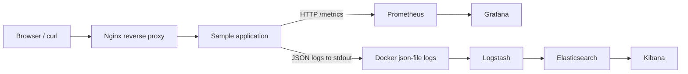
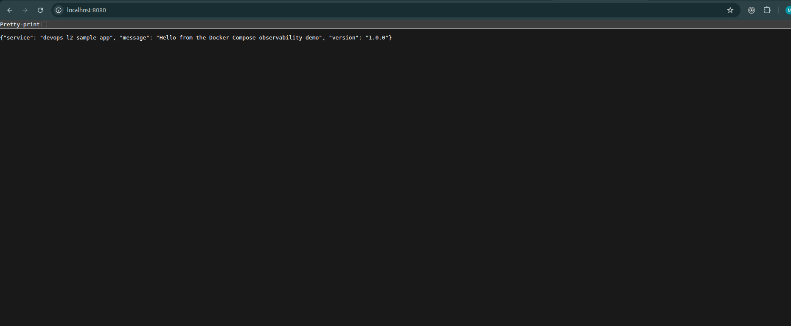
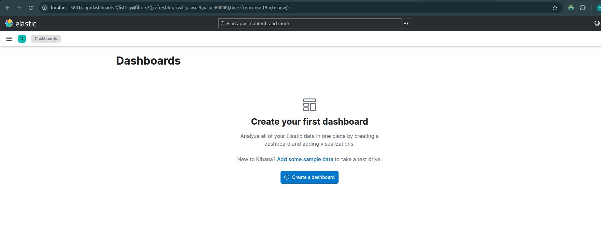
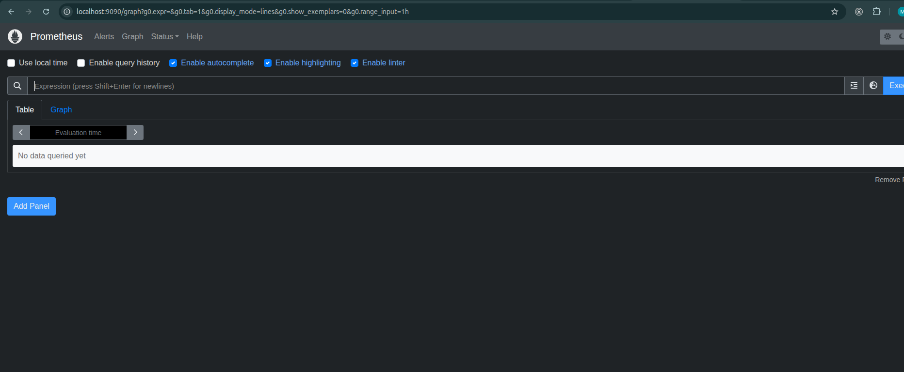
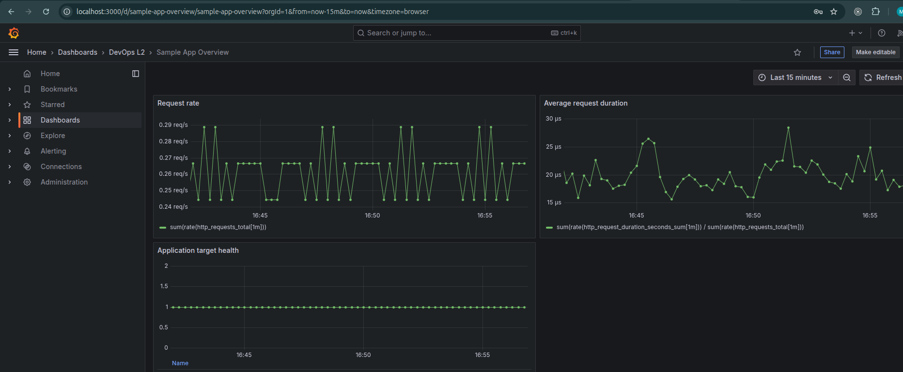

# DevOps L2 Assignment: Local Observability Platform

This project demonstrates a complete local DevOps environment built with
Docker Compose. A lightweight sample application is placed behind an Nginx
reverse proxy. Application logs are collected from Docker, processed by
Logstash, stored in Elasticsearch, and viewed in Kibana. Application metrics
are scraped by Prometheus and displayed in Grafana.

The project is designed for local learning and evaluation. It does not require
cloud infrastructure, Kubernetes, or an external application.

## 1. Architecture



### Request flow

1. A browser or `curl` sends a request to Nginx on port `8080`.
2. Nginx resolves the Docker service name `app` and forwards the request to
   the application on port `8000`.
3. The application returns the response and writes a structured JSON access
   log to standard output.

### Log flow

1. Docker stores application and Nginx stdout/stderr using the `json-file`
   logging driver.
2. Logstash reads those Docker log files through a read-only host mount.
3. Logstash decodes the Docker envelope and parses application JSON logs.
4. Logstash sends events to Elasticsearch indices named
   `docker-logs-YYYY.MM.dd`.
5. Kibana connects to Elasticsearch so the logs can be searched and displayed.

### Metrics flow

1. The application exposes Prometheus-compatible metrics at `/metrics`.
2. Prometheus scrapes `app:8000/metrics` every 15 seconds over the internal
   Docker network.
3. Grafana uses Prometheus as its data source and displays request rate,
   average request duration, and application target health.

## 2. Services and ports

All containers share the private Docker bridge network
`devops-l2_observability`. Internal service-to-service communication uses
Docker DNS names instead of container IP addresses.

| Service | Container port | Host port | Purpose |
| --- | ---: | ---: | --- |
| `app` | 8000 | Not exposed | Sample HTTP application, health endpoint, metrics, JSON logs |
| `nginx` | 8080 | 8080 | Reverse proxy and public application entry point |
| `elasticsearch` | 9200 | 9200, localhost only | Log storage and search |
| `logstash` | 9600 | 9600, localhost only | Pipeline monitoring and log processing |
| `kibana` | 5601 | 5601, localhost only | Elasticsearch log search UI |
| `prometheus` | 9090 | 9090, localhost only | Metrics collection and query UI |
| `grafana` | 3000 | 3000, localhost only | Metrics dashboard |

Only Nginx is exposed on all local interfaces. The management interfaces are
bound to `127.0.0.1` for local access only, and the application port is
available only inside Docker.

## 3. Repository structure

```text
.
├── app/
│   ├── Dockerfile
│   └── app.py
├── grafana/
│   ├── dashboards/
│   │   └── sample-app.json
│   └── provisioning/
│       ├── dashboards/
│       │   └── dashboards.yml
│       └── datasources/
│           └── prometheus.yml
├── logstash/
│   ├── config/
│   │   └── logstash.yml
│   └── pipeline/
│       └── logstash.conf
├── nginx/
│   └── nginx.conf
├── prometheus/
│   └── prometheus.yml
├── docs/
│   └── screenshots/
│       ├── Grafana.png
│       ├── kibana.png
│       ├── nginxapp.png
│       └── prometheous.png
├── docker-compose.yml
├── .gitignore
└── README.md
```

## 4. Prerequisites

The tested environment used:

- Ubuntu Linux
- Docker Engine 29.8.0
- Docker Compose v5.5.1
- Approximately 8 GB RAM recommended
- At least 5 GB free disk space for Docker images and named volumes
- A browser and `curl`

Elasticsearch is configured as a single-node development instance with a
512 MB Java heap. Logstash uses a 256 MB Java heap. On Linux, Elasticsearch
also requires:

```bash
sysctl vm.max_map_count
```

The value should be at least `262144`. If required:

```bash
sudo sysctl -w vm.max_map_count=262144
```

The Logstash input reads `/var/lib/docker/containers`, so the current logging
method is intended for a Linux Docker Engine host. Docker Desktop may require
an alternative log forwarding method or a shared Docker data path.

## 5. Start the environment

Run these commands from the repository root:

```bash
cd /home/mohit/Desktop/Projects/devops-L2
docker compose config
docker compose up -d --build
docker compose ps
```

`docker compose config` should complete without errors. The final
`docker compose ps` output should show all seven services running, with
health checks becoming `healthy` after Elasticsearch, Kibana, Logstash,
Prometheus, and Grafana finish starting.

The first startup can take one to two minutes because Elasticsearch and Kibana
need time to initialize.

## 6. Application and UI URLs

Open these URLs after the containers are healthy:

| Component | URL | What to verify |
| --- | --- | --- |
| Application through Nginx | [http://localhost:8080](http://localhost:8080) | The request is reverse-proxied to the app |
| Kibana | [http://localhost:5601](http://localhost:5601) | Search logs in Elasticsearch |
| Prometheus | [http://localhost:9090](http://localhost:9090) | Check the application target |
| Grafana | [http://localhost:3000](http://localhost:3000) | View the provisioned dashboard |

Grafana credentials for this local assignment are:

```text
Username: admin
Password: admin
```

In Kibana, create a data view named `docker-logs-*` and select `@timestamp`
as the time field. Grafana automatically provisions the Prometheus data source
and the `Sample App Overview` dashboard.

### UI evidence

#### Application through Nginx



#### Kibana



#### Prometheus



#### Grafana



## 7. Verification checklist

### 7.1 Docker Compose and health checks

```bash
docker compose config --quiet
docker compose ps
docker inspect --format '{{.Name}} {{.State.Health.Status}}' \
  $(docker compose ps -q)
```

The service status should be `Up`, and services with health checks should
report `healthy`.

### 7.2 Application and Nginx

```bash
curl -i http://localhost:8080/
curl -i http://localhost:8080/health
curl -s http://localhost:8080/metrics
docker compose logs --tail=20 app
```

Expected results:

- `/` returns HTTP `200` and the sample application JSON response.
- `/health` returns HTTP `200` and `{"status":"ok"}`.
- `/metrics` returns Prometheus text-format metrics.
- Application logs contain JSON access events.

The application is not directly published to the host. To prove that Nginx is
using Docker networking to reach it:

```bash
docker compose exec -T nginx getent hosts app
docker compose exec -T nginx wget -qO- http://app:8000/health
```

### 7.3 Docker networking

```bash
docker network ls
docker network inspect devops-l2_observability
```

The network inspection should list `app`, `nginx`, `elasticsearch`, `logstash`,
`kibana`, `prometheus`, and `grafana`.

### 7.4 Elasticsearch and Logstash

```bash
curl -s http://localhost:9200/_cluster/health?pretty
curl -s http://localhost:9600/_node/pipelines?pretty
curl -s http://localhost:9200/_cat/indices?v
curl -s 'http://localhost:9200/docker-logs-*/_search?size=3&sort=@timestamp:desc' \
  | python3 -m json.tool
```

Elasticsearch should respond with a cluster health document. A single-node
cluster normally reports `yellow` because replica shards cannot be allocated;
the primary shards remain active and the environment is usable. Logstash
should report a running `main` pipeline. The `_cat/indices` command should
show one or more `docker-logs-*` indices.

To search specifically for application events:

```bash
curl -s --get \
  --data-urlencode 'q=app_log.service:sample-app' \
  --data-urlencode 'size=5' \
  http://localhost:9200/docker-logs-*/_search \
  | python3 -m json.tool
```

Allow approximately 15–60 seconds after generating traffic for Logstash to
read and index the Docker log files.

### 7.5 Prometheus

```bash
curl -s http://localhost:9090/-/ready
curl -s http://localhost:9090/api/v1/targets | python3 -m json.tool
curl -s --get \
  --data-urlencode 'query=up{job="sample-app"}' \
  http://localhost:9090/api/v1/query | python3 -m json.tool
```

The target `app:8000` should have `"health": "up"` and the query result should
contain the value `"1"`.

### 7.6 Grafana

```bash
curl -s http://localhost:3000/api/health
curl -u admin:admin -s http://localhost:3000/api/search \
  | python3 -m json.tool
```

The Grafana health endpoint should report `"database": "ok"`. The search
result should include `Sample App Overview`. The dashboard panels use:

- `sum(rate(http_requests_total[1m]))` for request rate
- Application request duration counters for average duration
- `up{job="sample-app"}` for target health

## 8. Failure and recovery testing

The following tests demonstrate how the stack behaves when dependencies are
unavailable.

### Application stopped

```bash
docker compose stop app
curl -i http://localhost:8080/health || true
curl -s --get \
  --data-urlencode 'query=up{job="sample-app"}' \
  http://localhost:9090/api/v1/query
docker compose start app
```

While the application is stopped, Nginx returns `502 Bad Gateway` because its
upstream is unavailable, and Prometheus eventually reports the target as down.
After the application becomes healthy again, Nginx returns HTTP `200` and
Prometheus returns to `up`.

### Logstash stopped

```bash
docker compose stop logstash
for i in $(seq 1 5); do curl -s http://localhost:8080/health >/dev/null; done
docker compose start logstash
sleep 20
curl -s http://localhost:9200/_cat/indices?v
```

The application continues to write Docker log files while Logstash is down.
After Logstash restarts, its file input can read the pending events and send
them to Elasticsearch.

### Prometheus stopped

```bash
docker compose stop prometheus
curl -sS -o /dev/null -w '%{http_code}\n' \
  http://localhost:9090/-/ready || true
docker compose start prometheus
```

Grafana cannot receive fresh Prometheus samples while Prometheus is stopped.
After Prometheus restarts, scraping resumes and the dashboard recovers.

## 9. Troubleshooting guide

### A container is not starting

```bash
docker compose ps
docker compose logs <service>
docker inspect <container-name>
```

Check the container exit code, the first configuration error in the logs, and
whether a host port is already in use.

### Nginx returns 502 Bad Gateway

Check the complete request path:

```bash
docker compose ps app nginx
docker compose logs --tail=50 nginx app
docker compose exec -T nginx getent hosts app
docker compose exec -T nginx wget -qO- http://app:8000/health
```

The most common causes are an unhealthy application, a wrong upstream service
name, an incorrect application port, or a Docker network problem.

### Logs are missing from Kibana

Trace the log path layer by layer:

```bash
docker compose logs --tail=30 app
docker compose exec -T logstash ls /var/lib/docker/containers
docker compose logs --tail=50 logstash
curl -s http://localhost:9600/_node/pipelines
curl -s http://localhost:9200/_cat/indices?v
```

Confirm that the application generated traffic, the Docker log directory is
mounted, Logstash's pipeline is running, and a `docker-logs-*` index exists.
In Kibana, make sure the data view is exactly `docker-logs-*` and the selected
time range includes the generated events.

### Prometheus target is DOWN

```bash
curl -s http://localhost:9090/api/v1/targets | python3 -m json.tool
docker compose exec -T prometheus wget -qO- http://app:8000/metrics
docker compose logs --tail=50 app prometheus
```

Check the target name, port, `/metrics` path, application health, and internal
DNS connectivity.

### Grafana shows No Data

Confirm that Prometheus is ready and that the target is up. Then check that
Grafana's Prometheus data source is provisioned, the dashboard query uses the
correct metric name, and the dashboard time range includes recent samples.

### Elasticsearch is unhealthy

```bash
docker compose logs elasticsearch
docker inspect devops-l2-elasticsearch-1
sysctl vm.max_map_count
```

Check available RAM, `vm.max_map_count`, volume permissions, and whether
another process is using port `9200`.

## 10. Rebuild and cleanup

Use a normal stop/start when you want to preserve named volumes:

```bash
docker compose down
docker compose up -d
```

Use a full reset when you want to remove Elasticsearch indices, Prometheus
history, Logstash queue state, and Grafana state:

```bash
docker compose down -v --remove-orphans
docker compose up -d --build
```

The `-v` option is destructive for local observability data and should not be
used when those logs or metrics need to be preserved.

## 11. Design and security decisions

- A lightweight dependency-free Python HTTP server keeps the application
  simple and makes the infrastructure easy to explain.
- Nginx is the only public application entry point.
- Docker service names provide stable internal DNS; container IP addresses are
  not hard-coded.
- Named volumes preserve Elasticsearch, Logstash, Prometheus, and Grafana data
  during normal restarts.
- Image versions are pinned instead of using `latest`.
- Elasticsearch security is disabled intentionally for this localhost-only
  assignment. It must not be exposed directly to an untrusted network.
- Grafana uses example credentials for the local demonstration only.
- Production improvements would include TLS, authentication, secrets
  management, least-privilege service accounts, resource limits, retention
  policies, and a dedicated log shipper such as Fluent Bit or Filebeat.
